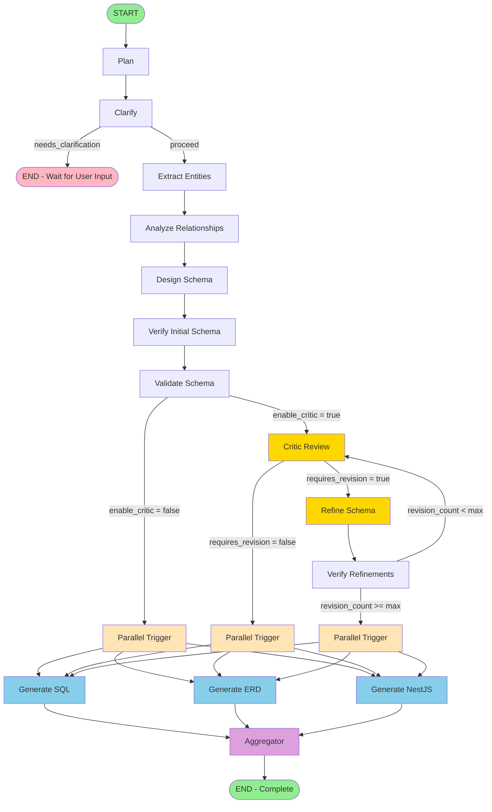
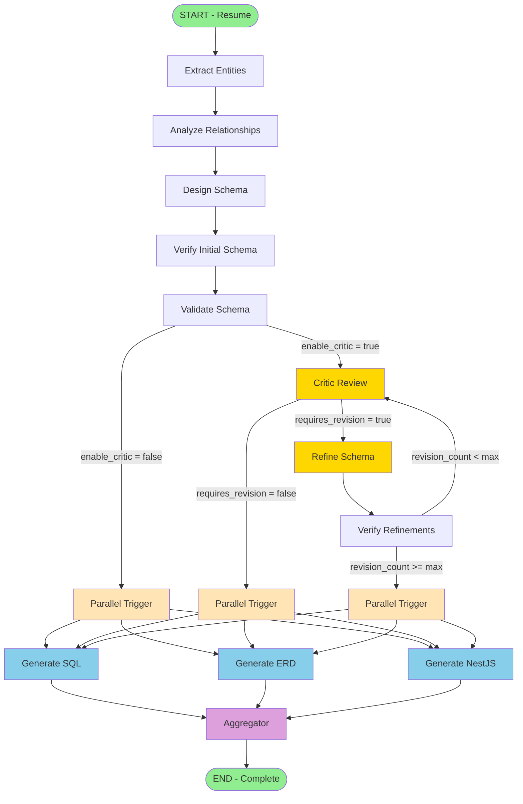
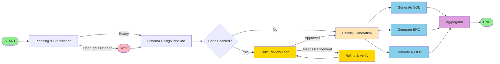

# RDBMS Builder - Graph Visualization

This document contains Mermaid diagrams for visualizing the RDBMS Builder LangGraph workflows.

## Main Graph (Initial Execution)

## Continuation Graph (After User Clarification)

## Simplified Overview (All Paths Combined)

## Node Details

### Planning Phase
- **plan**: Creates execution plan and task breakdown
- **clarify**: Identifies missing information and generates clarifying questions

### Schema Design Phase
- **extract_entities**: Identifies domain entities from requirements
- **analyze_relationships**: Determines relationships between entities
- **design_schema**: Creates initial database schema design
- **verify_initial_schema**: Validates the initial schema design

### Quality Assurance Phase
- **validate_schema**: Runs validation checks on schema
- **critic**: Reviews schema quality and provides feedback
- **refine_schema**: Improves schema based on critic feedback
- **verify_refinements**: Validates refined schema changes

### Generation Phase (Parallel Execution)
- **parallel_trigger**: Synchronization point for parallel execution
- **generate_sql**: Creates DDL scripts
- **generate_erd**: Creates Entity-Relationship Diagram (Mermaid format)
- **generate_nestjs**: Generates NestJS backend architecture

### Completion Phase
- **aggregator**: Collects all parallel generation outputs

## Conditional Logic

### should_clarify
- **needs_clarification**: User input required → END
- **proceed**: Continue to entity extraction

### should_run_critic
- **run_critic**: Critic enabled → Run critic review
- **generate_outputs**: Critic disabled → Skip to generation

### should_refine
- **refine**: Requires revision AND revision_count ≤ max_revisions
- **generate_outputs**: No refinement needed OR max revisions reached

### should_re_critique
- **re_critique**: revision_count < max_revisions → Run critic again
- **generate_outputs**: Max revisions reached → Proceed to generation

## Color Legend

- 🟢 **Green**: Start/End nodes
- 🔵 **Blue**: Generation nodes (parallel execution)
- 🟡 **Yellow**: Critic/refinement nodes
- 🟣 **Purple**: Aggregator/synchronization
- 🟠 **Orange**: Parallel trigger
- 🔴 **Pink**: Wait/pause state

## Usage Notes

1. The main graph handles initial execution and may pause for user clarification
2. The continuation graph resumes after user provides answers
3. Critic loop can run up to `max_critic_revisions` times (default: 2)
4. SQL, ERD, and NestJS generation run in parallel for performance
5. Checkpointing saves state at each node for resumability

## Integration with Excalidraw

To use in Excalidraw:
1. Copy any of the Mermaid code blocks above
2. In Excalidraw: Insert → Mermaid
3. Paste the code
4. The diagram will render automatically
5. You can then customize styling and layout in Excalidraw

