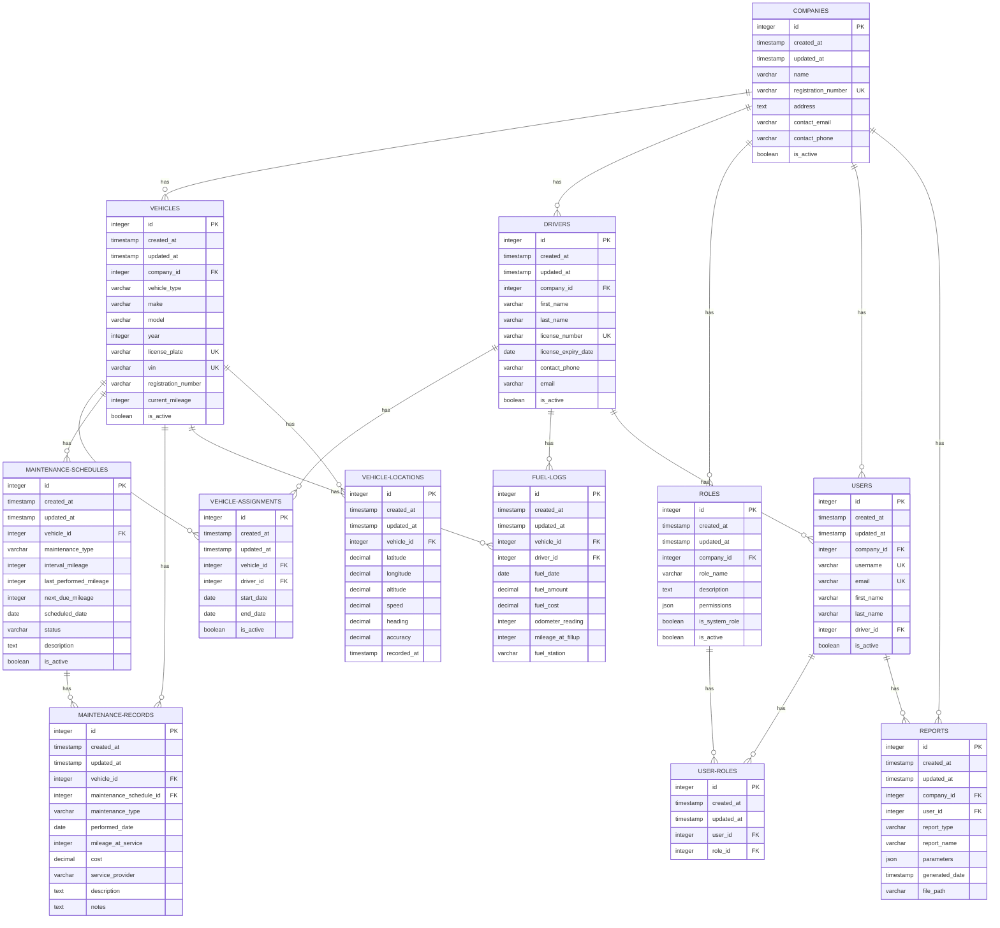

# ERD

```mermaid
erDiagram
    COMPANIES {
        integer id PK
        timestamp created_at
        timestamp updated_at
        varchar name
        varchar registration_number UK
        text address
        varchar contact_email
        varchar contact_phone
        boolean is_active
    }
    VEHICLES {
        integer id PK
        timestamp created_at
        timestamp updated_at
        integer company_id FK
        varchar vehicle_type
        varchar make
        varchar model
        integer year
        varchar license_plate UK
        varchar vin UK
        varchar registration_number
        integer current_mileage
        boolean is_active
    }
    DRIVERS {
        integer id PK
        timestamp created_at
        timestamp updated_at
        integer company_id FK
        varchar first_name
        varchar last_name
        varchar license_number UK
        date license_expiry_date
        varchar contact_phone
        varchar email
        boolean is_active
    }
    VEHICLE-ASSIGNMENTS {
        integer id PK
        timestamp created_at
        timestamp updated_at
        integer vehicle_id FK
        integer driver_id FK
        date start_date
        date end_date
        boolean is_active
    }
    MAINTENANCE-SCHEDULES {
        integer id PK
        timestamp created_at
        timestamp updated_at
        integer vehicle_id FK
        varchar maintenance_type
        integer interval_mileage
        integer last_performed_mileage
        integer next_due_mileage
        date scheduled_date
        varchar status
        text description
        boolean is_active
    }
    MAINTENANCE-RECORDS {
        integer id PK
        timestamp created_at
        timestamp updated_at
        integer vehicle_id FK
        integer maintenance_schedule_id FK
        varchar maintenance_type
        date performed_date
        integer mileage_at_service
        decimal cost
        varchar service_provider
        text description
        text notes
    }
    FUEL-LOGS {
        integer id PK
        timestamp created_at
        timestamp updated_at
        integer vehicle_id FK
        integer driver_id FK
        date fuel_date
        decimal fuel_amount
        decimal fuel_cost
        integer odometer_reading
        integer mileage_at_fillup
        varchar fuel_station
    }
    VEHICLE-LOCATIONS {
        integer id PK
        timestamp created_at
        timestamp updated_at
        integer vehicle_id FK
        decimal latitude
        decimal longitude
        decimal altitude
        decimal speed
        decimal heading
        decimal accuracy
        timestamp recorded_at
    }
    ROLES {
        integer id PK
        timestamp created_at
        timestamp updated_at
        integer company_id FK
        varchar role_name
        text description
        json permissions
        boolean is_system_role
        boolean is_active
    }
    USERS {
        integer id PK
        timestamp created_at
        timestamp updated_at
        integer company_id FK
        varchar username UK
        varchar email UK
        varchar first_name
        varchar last_name
        integer driver_id FK
        boolean is_active
    }
    USER-ROLES {
        integer id PK
        timestamp created_at
        timestamp updated_at
        integer user_id FK
        integer role_id FK
    }
    REPORTS {
        integer id PK
        timestamp created_at
        timestamp updated_at
        integer company_id FK
        integer user_id FK
        varchar report_type
        varchar report_name
        json parameters
        timestamp generated_date
        varchar file_path
    }

    COMPANIES ||--o{ VEHICLES : has
    COMPANIES ||--o{ DRIVERS : has
    VEHICLES ||--o{ VEHICLE-ASSIGNMENTS : has
    DRIVERS ||--o{ VEHICLE-ASSIGNMENTS : has
    VEHICLES ||--o{ MAINTENANCE-SCHEDULES : has
    VEHICLES ||--o{ MAINTENANCE-RECORDS : has
    MAINTENANCE-SCHEDULES ||--o{ MAINTENANCE-RECORDS : has
    VEHICLES ||--o{ FUEL-LOGS : has
    DRIVERS ||--o{ FUEL-LOGS : has
    VEHICLES ||--o{ VEHICLE-LOCATIONS : has
    COMPANIES ||--o{ ROLES : has
    COMPANIES ||--o{ USERS : has
    DRIVERS ||--o{ USERS : has
    USERS ||--o{ USER-ROLES : has
    ROLES ||--o{ USER-ROLES : has
    COMPANIES ||--o{ REPORTS : has
    USERS ||--o{ REPORTS : has
```
