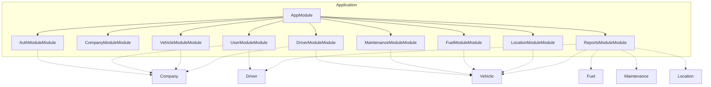

# Fleet Management System - Architecture Blueprint

> A comprehensive fleet management system that enables companies to register and manage their vehicle fleets, track drivers, monitor maintenance schedules, record fuel consumption, and track vehicle locations with GPS coordinates. The system supports role-based access control for managers and drivers, with full historical tracking capabilities.

---

## Table of Contents

1. [Directory Structure](#directory-structure)
2. [Module Architecture](#module-architecture)
3. [API Endpoints](#api-endpoints)
4. [Data Flows](#data-flows)
5. [Security](#security)
6. [Configuration](#configuration)

---

## Directory Structure

```
src/
├── app.module.ts
├── main.ts
├── common/
│   ├── guards/
│   │   ├── jwt-auth.guard.ts
│   │   └── roles.guard.ts
│   ├── interceptors/
│   │   ├── logging.interceptor.ts
│   │   └── transform.interceptor.ts
│   ├── pipes/
│   │   └── validation.pipe.ts
│   ├── decorators/
│   │   └── roles.decorator.ts
│   └── filters/
│       └── http-exception.filter.ts
├── config/
│   └── configuration.ts
├── auth-module/
│   ├── auth-module.module.ts
│   ├── auth-module.controller.ts
│   ├── auth-module.service.ts
│   ├── entities/
│   │   └── users.entity.ts
│   └── dto/
│       ├── create-users.dto.ts
│       └── update-users.dto.ts
├── company-module/
│   ├── company-module.module.ts
│   ├── company-module.controller.ts
│   ├── company-module.service.ts
│   ├── entities/
│   │   └── companies.entity.ts
│   └── dto/
│       ├── create-companies.dto.ts
│       └── update-companies.dto.ts
├── user-module/
│   ├── user-module.module.ts
│   ├── user-module.controller.ts
│   ├── user-module.service.ts
│   ├── entities/
│   │   └── users.entity.ts
│   └── dto/
│       ├── create-users.dto.ts
│       └── update-users.dto.ts
├── vehicle-module/
│   ├── vehicle-module.module.ts
│   ├── vehicle-module.controller.ts
│   ├── vehicle-module.service.ts
│   ├── entities/
│   │   └── vehicles.entity.ts
│   └── dto/
│       ├── create-vehicles.dto.ts
│       └── update-vehicles.dto.ts
├── driver-module/
│   ├── driver-module.module.ts
│   ├── driver-module.controller.ts
│   ├── driver-module.service.ts
│   ├── entities/
│   │   └── drivers.entity.ts
│   └── dto/
│       ├── create-drivers.dto.ts
│       └── update-drivers.dto.ts
├── maintenance-module/
│   ├── maintenance-module.module.ts
│   ├── maintenance-module.controller.ts
│   ├── maintenance-module.service.ts
│   ├── entities/
│   │   └── maintenance_schedules.entity.ts
│   └── dto/
│       ├── create-maintenance_schedules.dto.ts
│       └── update-maintenance_schedules.dto.ts
├── fuel-module/
│   ├── fuel-module.module.ts
│   ├── fuel-module.controller.ts
│   ├── fuel-module.service.ts
│   ├── entities/
│   │   └── fuel_logs.entity.ts
│   └── dto/
│       ├── create-fuel_logs.dto.ts
│       └── update-fuel_logs.dto.ts
├── location-module/
│   ├── location-module.module.ts
│   ├── location-module.controller.ts
│   ├── location-module.service.ts
│   ├── entities/
│   │   └── location_trackings.entity.ts
│   └── dto/
│       ├── create-location_trackings.dto.ts
│       └── update-location_trackings.dto.ts
├── reports-module/
│   ├── reports-module.module.ts
│   ├── reports-module.controller.ts
│   ├── reports-module.service.ts
│   ├── entities/
│   │   └── reports-module.entity.ts
│   └── dto/
│       ├── create-reports-module.dto.ts
│       └── update-reports-module.dto.ts
└── database/
    └── database.module.ts
```

## Module Architecture



### Modules Overview

#### AuthModuleModule

Handles user authentication, JWT token management, and session control

- **Entities**: users
- **Components**: Controller, Service, Repository
- **Dependencies**: CompanyModule

#### CompanyModuleModule

Manages company registration, profiles, and company-level operations

- **Entities**: companies
- **Components**: Controller, Service, Repository

#### UserModuleModule

Manages system users, roles, and permissions within companies

- **Entities**: users
- **Components**: Controller, Service, Repository
- **Dependencies**: CompanyModule, DriverModule

#### VehicleModuleModule

Manages vehicle fleet including registration, updates, and vehicle type management

- **Entities**: vehicles, vehicle_types
- **Components**: Controller, Service, Repository
- **Dependencies**: CompanyModule

#### DriverModuleModule

Manages driver profiles, assignments, and driver-vehicle relationships

- **Entities**: drivers, driver_assignments
- **Components**: Controller, Service, Repository
- **Dependencies**: CompanyModule, VehicleModule

#### MaintenanceModuleModule

Manages vehicle maintenance schedules, types, and tracking

- **Entities**: maintenance_schedules, maintenance_types
- **Components**: Controller, Service, Repository
- **Dependencies**: VehicleModule

#### FuelModuleModule

Manages fuel consumption logs and fuel-related analytics

- **Entities**: fuel_logs
- **Components**: Controller, Service, Repository
- **Dependencies**: VehicleModule

#### LocationModuleModule

Manages real-time GPS tracking and location history for vehicles

- **Entities**: location_trackings
- **Components**: Controller, Service, Repository
- **Dependencies**: VehicleModule

#### ReportsModuleModule

Generates comprehensive fleet performance and analytics reports

- **Entities**: 
- **Components**: Controller, Service, Repository
- **Dependencies**: VehicleModule, FuelModule, MaintenanceModule, LocationModule, DriverModule

## API Endpoints

| Method | Endpoint | Description | Auth | Roles |
|--------|----------|-------------|------|-------|
| POST | `/api/auth/login` | Authenticate user with username/email and password | ✗ | - |
| POST | `/api/auth/refresh` | Refresh expired JWT token using refresh token | ✗ | - |
| POST | `/api/auth/logout` | Invalidate user session and tokens | ✓ | - |
| GET | `/api/auth/profile` | Get current user profile information | ✓ | - |
| POST | `/api/companies` | Register a new company in the system | ✓ | admin |
| GET | `/api/companies/:id` | Get company details by ID | ✓ | admin, manager |
| PUT | `/api/companies/:id` | Update company information | ✓ | admin, manager |
| GET | `/api/companies/:id/dashboard` | Get company dashboard with fleet overview statistics | ✓ | manager, admin |
| POST | `/api/users` | Create a new user account | ✓ | admin, manager |
| GET | `/api/users` | Get paginated list of users within company | ✓ | manager, admin |
| GET | `/api/users/:id` | Get user details by ID | ✓ | - |
| PUT | `/api/users/:id` | Update user information | ✓ | admin, manager |
| PATCH | `/api/users/:id/status` | Activate or deactivate user account | ✓ | admin, manager |
| POST | `/api/vehicles` | Register a new vehicle in the fleet | ✓ | manager, admin |
| GET | `/api/vehicles` | Get paginated list of vehicles with filtering and sorting | ✓ | - |
| GET | `/api/vehicles/:id` | Get detailed vehicle information | ✓ | - |
| PUT | `/api/vehicles/:id` | Update vehicle information | ✓ | manager, admin |
| DELETE | `/api/vehicles/:id` | Remove vehicle from fleet (soft delete) | ✓ | manager, admin |
| GET | `/api/vehicle-types` | Get list of available vehicle types | ✓ | - |
| POST | `/api/vehicle-types` | Create new vehicle type | ✓ | admin |
| POST | `/api/drivers` | Register a new driver | ✓ | manager, admin |
| GET | `/api/drivers` | Get paginated list of drivers with filtering | ✓ | - |
| GET | `/api/drivers/:id` | Get driver details with assignment history | ✓ | - |
| PUT | `/api/drivers/:id` | Update driver information | ✓ | manager, admin |
| POST | `/api/driver-assignments` | Assign driver to vehicle | ✓ | manager, admin |
| PATCH | `/api/driver-assignments/:id/end` | End current driver assignment | ✓ | manager, admin |
| GET | `/api/driver-assignments/history/:vehicleId` | Get assignment history for a specific vehicle | ✓ | - |
| POST | `/api/maintenance-schedules` | Schedule maintenance for a vehicle | ✓ | manager, admin |
| GET | `/api/maintenance-schedules` | Get maintenance schedules with filtering by vehicle, date range, completion status | ✓ | - |
| GET | `/api/maintenance-schedules/overdue` | Get overdue maintenance schedules | ✓ | manager, admin |
| PATCH | `/api/maintenance-schedules/:id/complete` | Mark maintenance schedule as completed | ✓ | manager, admin |
| GET | `/api/maintenance-types` | Get list of maintenance types | ✓ | - |
| POST | `/api/maintenance-types` | Create new maintenance type | ✓ | admin |
| POST | `/api/fuel-logs` | Record fuel purchase/consumption | ✓ | driver, manager, admin |
| GET | `/api/fuel-logs` | Get fuel logs with filtering by vehicle, date range, fuel type | ✓ | - |
| GET | `/api/fuel-logs/vehicle/:vehicleId` | Get fuel consumption history for specific vehicle | ✓ | - |
| GET | `/api/fuel-logs/analytics/:vehicleId` | Get fuel consumption analytics for vehicle | ✓ | manager, admin |
| PUT | `/api/fuel-logs/:id` | Update fuel log entry | ✓ | manager, admin |
| POST | `/api/location-tracking` | Record vehicle GPS location data | ✓ | driver, system |
| GET | `/api/location-tracking/current/:vehicleId` | Get current location of specific vehicle | ✓ | - |
| GET | `/api/location-tracking/history/:vehicleId` | Get location history for vehicle within date range | ✓ | manager, admin |
| GET | `/api/location-tracking/fleet-map` | Get current locations of all vehicles in company fleet | ✓ | manager, admin |
| GET | `/api/location-tracking/route/:vehicleId` | Get vehicle route for specific date range | ✓ | manager, admin |
| GET | `/api/reports/fleet-performance` | Generate comprehensive fleet performance report | ✓ | manager, admin |
| GET | `/api/reports/vehicle-utilization` | Generate vehicle utilization report | ✓ | manager, admin |
| GET | `/api/reports/fuel-consumption` | Generate fuel consumption analysis report | ✓ | manager, admin |
| GET | `/api/reports/maintenance-costs` | Generate maintenance cost analysis report | ✓ | manager, admin |
| GET | `/api/reports/driver-performance` | Generate driver performance report | ✓ | manager, admin |
| POST | `/api/reports/custom` | Generate custom report with specified parameters | ✓ | manager, admin |

## Data Flows

These diagrams show how requests flow through the application.

### Create Vehicle

**Trigger**: `POST /api/vehicles`

```mermaid
sequenceDiagram
    participant Client
    participant VehicleController
    participant CompanyGuard
    participant ValidationPipe
    participant VehicleService
    participant VehicleRepository
    participant ResponseTransformInterceptor
    participant LoggingInterceptor
    Note over Client: POST /api/vehicles
    Client->>+VehicleController: Receive CreateVehicleDto, validate user authentication and manager role
    VehicleController->>+CompanyGuard: Verify user belongs to company specified in request
    CompanyGuard->>+ValidationPipe: Validate DTO fields, check required fields and data types
    ValidationPipe->>+VehicleService: Check for duplicate VIN and license plate within company
    VehicleService->>+VehicleRepository: Create vehicle record in database with company association
    VehicleRepository->>+ResponseTransformInterceptor: Transform response to standard format with created vehicle data
    ResponseTransformInterceptor->>+LoggingInterceptor: Log vehicle creation event for audit trail
    ResponseTransformInterceptor-->>-LoggingInterceptor: Response
    VehicleRepository-->>-ResponseTransformInterceptor: Response
    VehicleService-->>-VehicleRepository: Response
    ValidationPipe-->>-VehicleService: Response
    CompanyGuard-->>-ValidationPipe: Response
    VehicleController-->>-CompanyGuard: Response
    VehicleController-->>-Client: HTTP Response
```

**Steps**:

1. **VehicleController**: Receive CreateVehicleDto, validate user authentication and manager role
2. **CompanyGuard**: Verify user belongs to company specified in request
3. **ValidationPipe**: Validate DTO fields, check required fields and data types
4. **VehicleService**: Check for duplicate VIN and license plate within company
5. **VehicleRepository**: Create vehicle record in database with company association
6. **ResponseTransformInterceptor**: Transform response to standard format with created vehicle data
7. **LoggingInterceptor**: Log vehicle creation event for audit trail

### Real-time Location Tracking

**Trigger**: `POST /api/location-tracking`

```mermaid
sequenceDiagram
    participant Client
    participant LocationController
    participant JwtAuthGuard
    participant RateLimitMiddleware
    participant ValidationPipe
    participant LocationService
    participant LocationRepository
    participant WebSocketGateway
    Note over Client: POST /api/location-tracking
    Client->>+LocationController: Receive GPS coordinates from vehicle tracking device or mobile app
    LocationController->>+JwtAuthGuard: Validate driver or system authentication token
    JwtAuthGuard->>+RateLimitMiddleware: Check rate limits to prevent excessive location updates
    RateLimitMiddleware->>+ValidationPipe: Validate GPS coordinates, timestamp, and accuracy data
    ValidationPipe->>+LocationService: Process location data, calculate speed and heading if needed
    LocationService->>+LocationRepository: Store location record in database with optimized indexing
    LocationRepository->>+WebSocketGateway: Broadcast real-time location update to connected fleet managers
    LocationRepository-->>-WebSocketGateway: Response
    LocationService-->>-LocationRepository: Response
    ValidationPipe-->>-LocationService: Response
    RateLimitMiddleware-->>-ValidationPipe: Response
    JwtAuthGuard-->>-RateLimitMiddleware: Response
    LocationController-->>-JwtAuthGuard: Response
    LocationController-->>-Client: HTTP Response
```

**Steps**:

1. **LocationController**: Receive GPS coordinates from vehicle tracking device or mobile app
2. **JwtAuthGuard**: Validate driver or system authentication token
3. **RateLimitMiddleware**: Check rate limits to prevent excessive location updates
4. **ValidationPipe**: Validate GPS coordinates, timestamp, and accuracy data
5. **LocationService**: Process location data, calculate speed and heading if needed
6. **LocationRepository**: Store location record in database with optimized indexing
7. **WebSocketGateway**: Broadcast real-time location update to connected fleet managers

### Generate Fleet Performance Report

**Trigger**: `GET /api/reports/fleet-performance`

```mermaid
sequenceDiagram
    participant Client
    participant ReportsController
    participant RolesGuard
    participant CompanyGuard
    participant ReportsService
    participant VehicleService
    participant FuelService
    participant MaintenanceService
    participant CacheInterceptor
    Note over Client: GET /api/reports/fleet-performance
    Client->>+ReportsController: Receive report request with date range and filter parameters
    ReportsController->>+RolesGuard: Verify user has manager or admin role for report access
    RolesGuard->>+CompanyGuard: Ensure report scope is limited to user's company data
    CompanyGuard->>+ReportsService: Aggregate data from multiple services (Vehicle, Fuel, Maintenance, Location)
    ReportsService->>+VehicleService: Fetch vehicle utilization and mileage data
    VehicleService->>+FuelService: Calculate fuel consumption metrics and cost analysis
    FuelService->>+MaintenanceService: Retrieve maintenance costs and schedule compliance data
    MaintenanceService->>+ReportsService: Compile comprehensive report with charts and analytics
    ReportsService->>+CacheInterceptor: Cache report results for improved performance on repeated requests
    MaintenanceService-->>-CacheInterceptor: Response
    FuelService-->>-MaintenanceService: Response
    VehicleService-->>-FuelService: Response
    ReportsService-->>-VehicleService: Response
    CompanyGuard-->>-ReportsService: Response
    RolesGuard-->>-CompanyGuard: Response
    ReportsController-->>-RolesGuard: Response
    ReportsController-->>-Client: HTTP Response
```

**Steps**:

1. **ReportsController**: Receive report request with date range and filter parameters
2. **RolesGuard**: Verify user has manager or admin role for report access
3. **CompanyGuard**: Ensure report scope is limited to user's company data
4. **ReportsService**: Aggregate data from multiple services (Vehicle, Fuel, Maintenance, Location)
5. **VehicleService**: Fetch vehicle utilization and mileage data
6. **FuelService**: Calculate fuel consumption metrics and cost analysis
7. **MaintenanceService**: Retrieve maintenance costs and schedule compliance data
8. **ReportsService**: Compile comprehensive report with charts and analytics
9. **CacheInterceptor**: Cache report results for improved performance on repeated requests

### Assign Driver to Vehicle

**Trigger**: `POST /api/driver-assignments`

```mermaid
sequenceDiagram
    participant Client
    participant DriverController
    participant RolesGuard
    participant ValidationPipe
    participant DriverService
    participant VehicleService
    participant DriverAssignmentRepository
    participant NotificationService
    Note over Client: POST /api/driver-assignments
    Client->>+DriverController: Receive assignment request with vehicle_id, driver_id, and start_date
    DriverController->>+RolesGuard: Verify user has manager or admin role for assignment operations
    RolesGuard->>+ValidationPipe: Validate assignment data and check date format
    ValidationPipe->>+DriverService: Check if driver is available and not currently assigned to another vehicle
    DriverService->>+VehicleService: Verify vehicle exists and is not currently assigned to another driver
    VehicleService->>+DriverService: End any existing active assignments for both driver and vehicle
    DriverService->>+DriverAssignmentRepository: Create new assignment record with is_active=true
    DriverAssignmentRepository->>+NotificationService: Send assignment notification to driver and relevant managers
    DriverAssignmentRepository-->>-NotificationService: Response
    VehicleService-->>-DriverAssignmentRepository: Response
    DriverService-->>-VehicleService: Response
    ValidationPipe-->>-DriverService: Response
    RolesGuard-->>-ValidationPipe: Response
    DriverController-->>-RolesGuard: Response
    DriverController-->>-Client: HTTP Response
```

**Steps**:

1. **DriverController**: Receive assignment request with vehicle_id, driver_id, and start_date
2. **RolesGuard**: Verify user has manager or admin role for assignment operations
3. **ValidationPipe**: Validate assignment data and check date format
4. **DriverService**: Check if driver is available and not currently assigned to another vehicle
5. **VehicleService**: Verify vehicle exists and is not currently assigned to another driver
6. **DriverService**: End any existing active assignments for both driver and vehicle
7. **DriverAssignmentRepository**: Create new assignment record with is_active=true
8. **NotificationService**: Send assignment notification to driver and relevant managers

## Security

### Guards

#### JwtAuthGuard
- **Purpose**: Validates JWT tokens and ensures user authentication
- **Applies to**: All protected endpoints except /api/auth/login and /api/auth/refresh

#### RolesGuard
- **Purpose**: Enforces role-based access control (admin, manager, driver)
- **Applies to**: Endpoints requiring specific roles, /api/companies/*, /api/users/*, /api/reports/*

#### CompanyGuard
- **Purpose**: Ensures users can only access data within their own company
- **Applies to**: All data endpoints to enforce company-level data isolation

#### DriverSelfAccessGuard
- **Purpose**: Allows drivers to access only their own profile and assigned vehicle data
- **Applies to**: /api/drivers/:id, /api/vehicles (filtered), /api/fuel-logs (own vehicle only)

### Interceptors

#### LoggingInterceptor
- **Purpose**: Logs all API requests and responses for audit trail
- **Applies to**: global

#### ResponseTransformInterceptor
- **Purpose**: Standardizes API response format with metadata
- **Applies to**: global

#### CacheInterceptor
- **Purpose**: Caches frequently accessed data like vehicle types and maintenance types
- **Applies to**: /api/vehicle-types, /api/maintenance-types, /api/companies/:id/dashboard

#### CompanyFilterInterceptor
- **Purpose**: Automatically filters data by user's company context
- **Applies to**: All data retrieval endpoints

### Pipes

- **ValidationPipe**: Validates request DTOs and transforms data types
- **ParseUUIDPipe**: Validates and parses UUID parameters in routes
- **DefaultValuesPipe**: Sets default values for optional query parameters like pagination

### Middlewares

#### CorsMiddleware
- **Purpose**: Handles Cross-Origin Resource Sharing for frontend applications
- **Routes**: *

#### RateLimitMiddleware
- **Purpose**: Implements rate limiting to prevent API abuse
- **Routes**: /api/auth/*, /api/location-tracking

#### RequestIdMiddleware
- **Purpose**: Generates unique request IDs for tracing and debugging
- **Routes**: *

## Configuration

### Environment Variables

```env
DATABASE_URL=
JWT_SECRET=
JWT_EXPIRATION_TIME=
REFRESH_TOKEN_SECRET=
REFRESH_TOKEN_EXPIRATION_TIME=
REDIS_URL=
CORS_ORIGIN=
API_PORT=
NODE_ENV=
LOG_LEVEL=
RATE_LIMIT_TTL=
RATE_LIMIT_MAX_REQUESTS=
WEBSOCKET_PORT=
FILE_UPLOAD_MAX_SIZE=
ENCRYPTION_KEY=
```

### External Integrations

- Redis - Caching and session management
- WebSocket Gateway - Real-time location updates and notifications
- Email Service (SendGrid/AWS SES) - User notifications and reports
- File Storage (AWS S3/Google Cloud Storage) - Document and image storage
- GPS Tracking API - Integration with vehicle tracking devices
- Mapping Service (Google Maps/Mapbox) - Route visualization and geocoding
- SMS Service - Critical alerts and notifications
- PDF Generation Service - Report generation and export
- Monitoring Service (DataDog/New Relic) - Application performance monitoring

