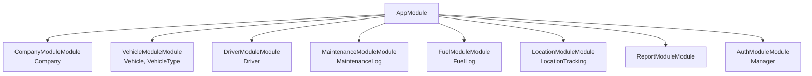

# FleetManagementSystem - Architecture Blueprint

> Fleet management system for companies to manage vehicles, drivers, maintenance, fuel consumption, and real-time GPS tracking

---

## Table of Contents

1. [Directory Structure](#directory-structure)
2. [Module Architecture](#module-architecture)
3. [API Endpoints](#api-endpoints)
4. [Data Flows](#data-flows)
5. [Event-Driven Architecture](#event-driven-architecture)
6. [Security](#security)
7. [Configuration](#configuration)

---

## Directory Structure

```
src/
├── app.module.ts
├── main.ts
├── common/
│   ├── guards/
│   ├── interceptors/
│   ├── pipes/
│   └── decorators/
├── config/
├── company-module/
│   ├── company-module.module.ts
│   ├── company-module.controller.ts
│   ├── company-module.service.ts
│   ├── entities/
│   └── dto/
├── vehicle-module/
│   ├── vehicle-module.module.ts
│   ├── vehicle-module.controller.ts
│   ├── vehicle-module.service.ts
│   ├── entities/
│   └── dto/
├── driver-module/
│   ├── driver-module.module.ts
│   ├── driver-module.controller.ts
│   ├── driver-module.service.ts
│   ├── entities/
│   └── dto/
├── maintenance-module/
│   ├── maintenance-module.module.ts
│   ├── maintenance-module.controller.ts
│   ├── maintenance-module.service.ts
│   ├── entities/
│   └── dto/
├── fuel-module/
│   ├── fuel-module.module.ts
│   ├── fuel-module.controller.ts
│   ├── fuel-module.service.ts
│   ├── entities/
│   └── dto/
├── location-module/
│   ├── location-module.module.ts
│   ├── location-module.controller.ts
│   ├── location-module.service.ts
│   ├── entities/
│   └── dto/
├── report-module/
│   ├── report-module.module.ts
│   ├── report-module.controller.ts
│   ├── report-module.service.ts
│   ├── entities/
│   └── dto/
└── auth-module/
│   ├── auth-module.module.ts
│   ├── auth-module.controller.ts
│   ├── auth-module.service.ts
│   ├── entities/
│   └── dto/
```

## Module Architecture



### Modules Overview

#### CompanyModuleModule

Manages Company

- **Entities**: Company
- **Components**: Controller, Service, Repository

#### VehicleModuleModule

Manages Vehicle, VehicleType

- **Entities**: Vehicle, VehicleType
- **Components**: Controller, Service, Repository

#### DriverModuleModule

Manages Driver

- **Entities**: Driver
- **Components**: Controller, Service, Repository

#### MaintenanceModuleModule

Manages MaintenanceLog

- **Entities**: MaintenanceLog
- **Components**: Controller, Service, Repository

#### FuelModuleModule

Manages FuelLog

- **Entities**: FuelLog
- **Components**: Controller, Service, Repository

#### LocationModuleModule

Manages LocationTracking

- **Entities**: LocationTracking
- **Components**: Controller, Service, Repository

#### ReportModuleModule

Manages 

- **Entities**: 
- **Components**: Controller, Service, Repository

#### AuthModuleModule

Manages Manager

- **Entities**: Manager
- **Components**: Controller, Service, Repository

## API Endpoints

| Method | Endpoint | Description |
|--------|----------|-------------|
| POST | `/api/auth/login` | Manager authentication |
| GET | `/api/vehicles` | Get company vehicles with filters |
| POST | `/api/vehicles/:vehicleId/locations` | Record real-time GPS location |
| GET | `/api/vehicles/:vehicleId/current-location` | Get current vehicle location |
| POST | `/api/drivers/:id/assign-vehicle` | Assign driver to vehicle |
| POST | `/api/vehicles/:vehicleId/maintenance` | Log maintenance record |
| POST | `/api/vehicles/:vehicleId/fuel-logs` | Record fuel consumption |
| GET | `/api/reports/fleet-performance` | Generate fleet performance report |
| GET | `/api/reports/fuel-consumption` | Generate fuel consumption report |
| GET | `/api/reports/maintenance-summary` | Generate maintenance summary report |

## Data Flows

These diagrams show how requests flow through the application.

## Event-Driven Architecture

**Message Queue**: Redis

### Event Patterns

This system uses event-driven architecture for asynchronous processing and real-time updates.

#### `vehicle.location.updated`

- **Trigger**: GPS device sends location data every few seconds
- **Purpose**: Real-time location tracking and analytics
- **Consumers**: LocationModule, ReportModule

#### `driver.assigned`

- **Trigger**: Manager assigns driver to vehicle
- **Purpose**: Update vehicle assignment status
- **Consumers**: VehicleModule, ReportModule

#### `maintenance.completed`

- **Trigger**: Maintenance log is created
- **Purpose**: Update vehicle status and reports
- **Consumers**: VehicleModule, ReportModule

#### `fuel.logged`

- **Trigger**: Fuel consumption is recorded
- **Purpose**: Update mileage and fuel analytics
- **Consumers**: VehicleModule, ReportModule

### Implementation Guide

1. Install event emitter: `npm install @nestjs/event-emitter`
2. Install message queue: `npm install @nestjs/microservices ioredis`
3. Import EventEmitterModule in AppModule
4. Emit events: `this.eventEmitter.emit('event.name', payload)`
5. Listen with decorators: `@OnEvent('event.name')`

## Security

### Guards

#### JwtAuthGuard
- **Purpose**: Authentication/Authorization
- **Applies to**: All protected routes

#### CompanyGuard
- **Purpose**: Authentication/Authorization
- **Applies to**: All protected routes

#### ManagerRoleGuard
- **Purpose**: Authentication/Authorization
- **Applies to**: All protected routes

### Interceptors

#### LoggingInterceptor
- **Purpose**: Request/Response logging
- **Applies to**: Global

#### TransformInterceptor
- **Purpose**: Response transformation
- **Applies to**: Global

### Pipes

- **ValidationPipe**: DTO validation

### Middlewares

#### LoggerMiddleware
- **Purpose**: HTTP request logging
- **Routes**: *

## Configuration

### Environment Variables

```env
DATABASE_URL=
JWT_SECRET=
JWT_EXPIRES_IN=
REDIS_URL=
GPS_TRACKING_INTERVAL=
```

