# Fleet Management System - Architecture Blueprint

> A comprehensive fleet management system that enables companies to register and manage their vehicle fleets, assign drivers, track maintenance schedules, monitor fuel consumption, record GPS locations, and generate performance reports.

---

## Table of Contents

1. [Directory Structure](#directory-structure)
2. [Module Architecture](#module-architecture)
3. [API Endpoints](#api-endpoints)
4. [Data Flows](#data-flows)
5. [Security](#security)
6. [Configuration](#configuration)

---

## Directory Structure

```
src/
├── app.module.ts
├── main.ts
├── common/
│   ├── guards/
│   │   ├── jwt-auth.guard.ts
│   │   └── roles.guard.ts
│   ├── interceptors/
│   │   ├── logging.interceptor.ts
│   │   └── transform.interceptor.ts
│   ├── pipes/
│   │   └── validation.pipe.ts
│   ├── decorators/
│   │   └── roles.decorator.ts
│   └── filters/
│       └── http-exception.filter.ts
├── config/
│   └── configuration.ts
├── auth-module/
│   ├── auth-module.module.ts
│   ├── auth-module.controller.ts
│   ├── auth-module.service.ts
│   ├── entities/
│   │   └── managers.entity.ts
│   └── dto/
│       ├── create-managers.dto.ts
│       └── update-managers.dto.ts
├── company-module/
│   ├── company-module.module.ts
│   ├── company-module.controller.ts
│   ├── company-module.service.ts
│   ├── entities/
│   │   └── companies.entity.ts
│   └── dto/
│       ├── create-companies.dto.ts
│       └── update-companies.dto.ts
├── manager-module/
│   ├── manager-module.module.ts
│   ├── manager-module.controller.ts
│   ├── manager-module.service.ts
│   ├── entities/
│   │   └── managers.entity.ts
│   └── dto/
│       ├── create-managers.dto.ts
│       └── update-managers.dto.ts
├── driver-module/
│   ├── driver-module.module.ts
│   ├── driver-module.controller.ts
│   ├── driver-module.service.ts
│   ├── entities/
│   │   └── drivers.entity.ts
│   └── dto/
│       ├── create-drivers.dto.ts
│       └── update-drivers.dto.ts
├── vehicle-type-module/
│   ├── vehicle-type-module.module.ts
│   ├── vehicle-type-module.controller.ts
│   ├── vehicle-type-module.service.ts
│   ├── entities/
│   │   └── vehicle_types.entity.ts
│   └── dto/
│       ├── create-vehicle_types.dto.ts
│       └── update-vehicle_types.dto.ts
├── vehicle-module/
│   ├── vehicle-module.module.ts
│   ├── vehicle-module.controller.ts
│   ├── vehicle-module.service.ts
│   ├── entities/
│   │   └── vehicles.entity.ts
│   └── dto/
│       ├── create-vehicles.dto.ts
│       └── update-vehicles.dto.ts
├── vehicle-assignment-module/
│   ├── vehicle-assignment-module.module.ts
│   ├── vehicle-assignment-module.controller.ts
│   ├── vehicle-assignment-module.service.ts
│   ├── entities/
│   │   └── vehicle_assignments.entity.ts
│   └── dto/
│       ├── create-vehicle_assignments.dto.ts
│       └── update-vehicle_assignments.dto.ts
├── maintenance-type-module/
│   ├── maintenance-type-module.module.ts
│   ├── maintenance-type-module.controller.ts
│   ├── maintenance-type-module.service.ts
│   ├── entities/
│   │   └── maintenance_types.entity.ts
│   └── dto/
│       ├── create-maintenance_types.dto.ts
│       └── update-maintenance_types.dto.ts
├── maintenance-module/
│   ├── maintenance-module.module.ts
│   ├── maintenance-module.controller.ts
│   ├── maintenance-module.service.ts
│   ├── entities/
│   │   └── maintenance_schedules.entity.ts
│   └── dto/
│       ├── create-maintenance_schedules.dto.ts
│       └── update-maintenance_schedules.dto.ts
├── fuel-module/
│   ├── fuel-module.module.ts
│   ├── fuel-module.controller.ts
│   ├── fuel-module.service.ts
│   ├── entities/
│   │   └── fuel_logs.entity.ts
│   └── dto/
│       ├── create-fuel_logs.dto.ts
│       └── update-fuel_logs.dto.ts
├── location-module/
│   ├── location-module.module.ts
│   ├── location-module.controller.ts
│   ├── location-module.service.ts
│   ├── entities/
│   │   └── location_logs.entity.ts
│   └── dto/
│       ├── create-location_logs.dto.ts
│       └── update-location_logs.dto.ts
├── report-module/
│   ├── report-module.module.ts
│   ├── report-module.controller.ts
│   ├── report-module.service.ts
│   ├── entities/
│   │   └── report-module.entity.ts
│   └── dto/
│       ├── create-report-module.dto.ts
│       └── update-report-module.dto.ts
└── database/
    └── database.module.ts
```

## Module Architecture

```mermaid
graph TD
    subgraph Application
        AppModule[AppModule]
        AuthModule[AuthModuleModule]
        AppModule --> AuthModule
        CompanyModule[CompanyModuleModule]
        AppModule --> CompanyModule
        ManagerModule[ManagerModuleModule]
        AppModule --> ManagerModule
        DriverModule[DriverModuleModule]
        AppModule --> DriverModule
        VehicleTypeModule[VehicleTypeModuleModule]
        AppModule --> VehicleTypeModule
        VehicleModule[VehicleModuleModule]
        AppModule --> VehicleModule
        VehicleAssignmentModule[VehicleAssignmentModuleModule]
        AppModule --> VehicleAssignmentModule
        MaintenanceTypeModule[MaintenanceTypeModuleModule]
        AppModule --> MaintenanceTypeModule
        MaintenanceModule[MaintenanceModuleModule]
        AppModule --> MaintenanceModule
        FuelModule[FuelModuleModule]
        AppModule --> FuelModule
        LocationModule[LocationModuleModule]
        AppModule --> LocationModule
        ReportModule[ReportModuleModule]
        AppModule --> ReportModule
    end

    AuthModule -.-> Company
    ManagerModule -.-> Company
    DriverModule -.-> Company
    VehicleModule -.-> Company
    VehicleModule -.-> VehicleType
    VehicleAssignmentModule -.-> Driver
    VehicleAssignmentModule -.-> Vehicle
    MaintenanceModule -.-> Vehicle
    MaintenanceModule -.-> MaintenanceType
    FuelModule -.-> Vehicle
    LocationModule -.-> Vehicle
    ReportModule -.-> Vehicle
    ReportModule -.-> Maintenance
    ReportModule -.-> Fuel
    ReportModule -.-> Location
    ReportModule -.-> Driver
```



### Modules Overview

#### AuthModuleModule

Handles authentication and authorization for managers and system users

- **Entities**: managers
- **Components**: Controller, Service, Repository
- **Dependencies**: CompanyModule

#### CompanyModuleModule

Manages company registration, profile updates, and company-related operations

- **Entities**: companies
- **Components**: Controller, Service, Repository

#### ManagerModuleModule

Manages company managers, their access levels, and department assignments

- **Entities**: managers
- **Components**: Controller, Service, Repository
- **Dependencies**: CompanyModule

#### DriverModuleModule

Manages company drivers, their licenses, and employment information

- **Entities**: drivers
- **Components**: Controller, Service, Repository
- **Dependencies**: CompanyModule

#### VehicleTypeModuleModule

Manages vehicle type definitions and their characteristics

- **Entities**: vehicle_types
- **Components**: Controller, Service, Repository

#### VehicleModuleModule

Manages fleet vehicles, their specifications, and status tracking

- **Entities**: vehicles
- **Components**: Controller, Service, Repository
- **Dependencies**: CompanyModule, VehicleTypeModule

#### VehicleAssignmentModuleModule

Manages driver-to-vehicle assignments and assignment history

- **Entities**: vehicle_assignments
- **Components**: Controller, Service, Repository
- **Dependencies**: DriverModule, VehicleModule

#### MaintenanceTypeModuleModule

Manages maintenance type definitions with cost and duration estimates

- **Entities**: maintenance_types
- **Components**: Controller, Service, Repository

#### MaintenanceModuleModule

Manages maintenance schedules and historical maintenance records

- **Entities**: maintenance_schedules, maintenance_records
- **Components**: Controller, Service, Repository
- **Dependencies**: VehicleModule, MaintenanceTypeModule

#### FuelModuleModule

Manages fuel consumption logs and fuel-related analytics

- **Entities**: fuel_logs
- **Components**: Controller, Service, Repository
- **Dependencies**: VehicleModule

#### LocationModuleModule

Manages GPS tracking data and location-based services

- **Entities**: location_logs
- **Components**: Controller, Service, Repository
- **Dependencies**: VehicleModule

#### ReportModuleModule

Generates comprehensive fleet performance and analytics reports

- **Entities**: 
- **Components**: Controller, Service, Repository
- **Dependencies**: VehicleModule, MaintenanceModule, FuelModule, LocationModule, DriverModule

## API Endpoints

| Method | Endpoint | Description | Auth | Roles |
|--------|----------|-------------|------|-------|
| POST | `/api/auth/login` | Manager login with email and password | ✗ | - |
| POST | `/api/auth/refresh` | Refresh JWT access token using refresh token | ✗ | - |
| POST | `/api/auth/logout` | Logout and invalidate tokens | ✓ | - |
| GET | `/api/auth/profile` | Get current manager profile information | ✓ | - |
| POST | `/api/companies` | Register a new fleet management company | ✗ | - |
| GET | `/api/companies/:id` | Get company details by ID | ✓ | admin, manager |
| PUT | `/api/companies/:id` | Update company information | ✓ | admin |
| DELETE | `/api/companies/:id` | Soft delete a company | ✓ | admin |
| POST | `/api/managers` | Create a new manager for a company | ✓ | admin |
| GET | `/api/managers` | Get paginated list of managers with filtering by company, department, access_level | ✓ | admin, manager |
| GET | `/api/managers/:id` | Get manager details by ID | ✓ | admin, manager |
| PUT | `/api/managers/:id` | Update manager information | ✓ | admin |
| DELETE | `/api/managers/:id` | Soft delete a manager | ✓ | admin |
| POST | `/api/drivers` | Add a new driver to a company | ✓ | admin, manager |
| GET | `/api/drivers` | Get paginated list of drivers with filtering by company, hire_date range | ✓ | admin, manager |
| GET | `/api/drivers/:id` | Get driver details by ID | ✓ | admin, manager |
| PUT | `/api/drivers/:id` | Update driver information | ✓ | admin, manager |
| DELETE | `/api/drivers/:id` | Soft delete a driver | ✓ | admin, manager |
| GET | `/api/drivers/:id/assignments` | Get driver's vehicle assignment history | ✓ | admin, manager |
| POST | `/api/vehicle-types` | Create a new vehicle type | ✓ | admin |
| GET | `/api/vehicle-types` | Get list of all vehicle types with filtering by fuel_type | ✓ | admin, manager |
| GET | `/api/vehicle-types/:id` | Get vehicle type details by ID | ✓ | admin, manager |
| PUT | `/api/vehicle-types/:id` | Update vehicle type information | ✓ | admin |
| DELETE | `/api/vehicle-types/:id` | Soft delete a vehicle type | ✓ | admin |
| POST | `/api/vehicles` | Add a new vehicle to company fleet | ✓ | admin, manager |
| GET | `/api/vehicles` | Get paginated list of vehicles with filtering by company, status, make, model, year | ✓ | admin, manager |
| GET | `/api/vehicles/:id` | Get vehicle details by ID | ✓ | admin, manager |
| PUT | `/api/vehicles/:id` | Update vehicle information | ✓ | admin, manager |
| PATCH | `/api/vehicles/:id/status` | Update vehicle status (active, maintenance, retired) | ✓ | admin, manager |
| DELETE | `/api/vehicles/:id` | Soft delete a vehicle | ✓ | admin, manager |
| POST | `/api/vehicle-assignments` | Assign a driver to a vehicle | ✓ | admin, manager |
| GET | `/api/vehicle-assignments` | Get paginated list of assignments with filtering by driver, vehicle, active status | ✓ | admin, manager |
| GET | `/api/vehicle-assignments/active` | Get all currently active vehicle assignments | ✓ | admin, manager |
| PATCH | `/api/vehicle-assignments/:id/end` | End a vehicle assignment | ✓ | admin, manager |
| GET | `/api/vehicle-assignments/:id` | Get assignment details by ID | ✓ | admin, manager |
| POST | `/api/maintenance-types` | Create a new maintenance type | ✓ | admin |
| GET | `/api/maintenance-types` | Get list of all maintenance types | ✓ | admin, manager |
| GET | `/api/maintenance-types/:id` | Get maintenance type details by ID | ✓ | admin, manager |
| PUT | `/api/maintenance-types/:id` | Update maintenance type information | ✓ | admin |
| DELETE | `/api/maintenance-types/:id` | Soft delete a maintenance type | ✓ | admin |
| POST | `/api/maintenance/schedules` | Create a maintenance schedule for a vehicle | ✓ | admin, manager |
| GET | `/api/maintenance/schedules` | Get paginated maintenance schedules with filtering by vehicle, due date, active status | ✓ | admin, manager |
| GET | `/api/maintenance/schedules/due` | Get maintenance schedules due within specified days | ✓ | admin, manager |
| POST | `/api/maintenance/records` | Record completed maintenance activity | ✓ | admin, manager |
| GET | `/api/maintenance/records` | Get paginated maintenance records with filtering by vehicle, date range, service provider | ✓ | admin, manager |
| GET | `/api/maintenance/vehicles/:vehicleId/history` | Get complete maintenance history for a vehicle | ✓ | admin, manager |
| PUT | `/api/maintenance/schedules/:id` | Update maintenance schedule | ✓ | admin, manager |
| POST | `/api/fuel-logs` | Record fuel purchase/consumption for a vehicle | ✓ | admin, manager |
| GET | `/api/fuel-logs` | Get paginated fuel logs with filtering by vehicle, date range, location | ✓ | admin, manager |
| GET | `/api/fuel-logs/vehicles/:vehicleId` | Get fuel consumption history for a specific vehicle | ✓ | admin, manager |
| GET | `/api/fuel-logs/analytics/consumption` | Get fuel consumption analytics by vehicle, time period | ✓ | admin, manager |
| GET | `/api/fuel-logs/analytics/costs` | Get fuel cost analytics and trends | ✓ | admin, manager |
| PUT | `/api/fuel-logs/:id` | Update fuel log entry | ✓ | admin, manager |
| DELETE | `/api/fuel-logs/:id` | Soft delete a fuel log entry | ✓ | admin, manager |
| POST | `/api/location-logs` | Record GPS location data for a vehicle | ✓ | system, admin |
| POST | `/api/location-logs/batch` | Bulk insert multiple location records | ✓ | system, admin |
| GET | `/api/location-logs/vehicles/:vehicleId/current` | Get current/latest location of a vehicle | ✓ | admin, manager |
| GET | `/api/location-logs/vehicles/:vehicleId/history` | Get location history for a vehicle within date range | ✓ | admin, manager |
| GET | `/api/location-logs/vehicles/:vehicleId/route` | Get route/path taken by vehicle for a specific date | ✓ | admin, manager |
| GET | `/api/location-logs/fleet/live` | Get live locations of all vehicles in fleet | ✓ | admin, manager |
| GET | `/api/reports/fleet-overview` | Generate comprehensive fleet overview report | ✓ | admin, manager |
| GET | `/api/reports/vehicle-utilization` | Generate vehicle utilization report by date range | ✓ | admin, manager |
| GET | `/api/reports/maintenance-costs` | Generate maintenance cost analysis report | ✓ | admin, manager |
| GET | `/api/reports/fuel-efficiency` | Generate fuel efficiency report by vehicle and time period | ✓ | admin, manager |
| GET | `/api/reports/driver-performance` | Generate driver performance report including assignments and vehicle usage | ✓ | admin, manager |
| POST | `/api/reports/custom` | Generate custom report based on specified parameters | ✓ | admin, manager |
| GET | `/api/reports/export/:reportType` | Export report data in specified format (PDF, Excel, CSV) | ✓ | admin, manager |

## Data Flows

These diagrams show how requests flow through the application.

### Create Vehicle Assignment

**Trigger**: `POST /api/vehicle-assignments`

```mermaid
sequenceDiagram
    participant Client
    participant VehicleAssignmentController
    participant JwtAuthGuard
    participant RolesGuard
    participant ValidationPipe
    participant VehicleAssignmentService
    participant VehicleAssignmentRepository
    participant ResponseTransformInterceptor
    Note over Client: POST /api/vehicle-assignments
    Client->>+VehicleAssignmentController: Receive assignment request with driver_id, vehicle_id, assignment_date
    VehicleAssignmentController->>+JwtAuthGuard: Validate JWT token and extract manager information
    JwtAuthGuard->>+RolesGuard: Check if manager has admin or manager role
    RolesGuard->>+ValidationPipe: Validate CreateVehicleAssignmentDto structure and constraints
    ValidationPipe->>+VehicleAssignmentService: Check if driver and vehicle belong to same company as manager
    VehicleAssignmentService->>+VehicleAssignmentService: Validate driver is not already assigned to another vehicle
    VehicleAssignmentService->>+VehicleAssignmentService: Validate vehicle is not already assigned to another driver
    VehicleAssignmentService->>+VehicleAssignmentService: End any existing active assignments for the driver and vehicle
    VehicleAssignmentService->>+VehicleAssignmentRepository: Create new vehicle assignment record in database
    VehicleAssignmentRepository->>+ResponseTransformInterceptor: Transform response to standard API format with created assignment data
    VehicleAssignmentRepository-->>-ResponseTransformInterceptor: Response
    VehicleAssignmentService-->>-VehicleAssignmentRepository: Response
    ValidationPipe-->>-VehicleAssignmentService: Response
    RolesGuard-->>-ValidationPipe: Response
    JwtAuthGuard-->>-RolesGuard: Response
    VehicleAssignmentController-->>-JwtAuthGuard: Response
    VehicleAssignmentController-->>-Client: HTTP Response
```

**Steps**:

1. **VehicleAssignmentController**: Receive assignment request with driver_id, vehicle_id, assignment_date
2. **JwtAuthGuard**: Validate JWT token and extract manager information
3. **RolesGuard**: Check if manager has admin or manager role
4. **ValidationPipe**: Validate CreateVehicleAssignmentDto structure and constraints
5. **VehicleAssignmentService**: Check if driver and vehicle belong to same company as manager
6. **VehicleAssignmentService**: Validate driver is not already assigned to another vehicle
7. **VehicleAssignmentService**: Validate vehicle is not already assigned to another driver
8. **VehicleAssignmentService**: End any existing active assignments for the driver and vehicle
9. **VehicleAssignmentRepository**: Create new vehicle assignment record in database
10. **ResponseTransformInterceptor**: Transform response to standard API format with created assignment data

### Get Fleet Live Locations

**Trigger**: `GET /api/location-logs/fleet/live`

```mermaid
sequenceDiagram
    participant Client
    participant LocationController
    participant JwtAuthGuard
    participant RolesGuard
    participant CacheInterceptor
    participant LocationService
    participant LocationRepository
    participant ResponseTransformInterceptor
    Note over Client: GET /api/location-logs/fleet/live
    Client->>+LocationController: Receive request for live fleet locations
    LocationController->>+JwtAuthGuard: Validate JWT token and extract manager information
    JwtAuthGuard->>+RolesGuard: Check if manager has admin or manager role
    RolesGuard->>+CacheInterceptor: Check if live location data exists in Redis cache (30 second TTL)
    CacheInterceptor->>+LocationService: Get all vehicles belonging to manager's company
    LocationService->>+LocationRepository: Query latest location record for each vehicle in the fleet
    LocationRepository->>+LocationService: Filter out stale location data (older than 10 minutes)
    LocationService->>+LocationService: Enrich location data with vehicle and driver information
    LocationService->>+CacheInterceptor: Store result in Redis cache with 30 second expiration
    CacheInterceptor->>+ResponseTransformInterceptor: Transform response to include fleet live location data
    LocationRepository-->>-ResponseTransformInterceptor: Response
    LocationService-->>-LocationRepository: Response
    CacheInterceptor-->>-LocationService: Response
    RolesGuard-->>-CacheInterceptor: Response
    JwtAuthGuard-->>-RolesGuard: Response
    LocationController-->>-JwtAuthGuard: Response
    LocationController-->>-Client: HTTP Response
```

**Steps**:

1. **LocationController**: Receive request for live fleet locations
2. **JwtAuthGuard**: Validate JWT token and extract manager information
3. **RolesGuard**: Check if manager has admin or manager role
4. **CacheInterceptor**: Check if live location data exists in Redis cache (30 second TTL)
5. **LocationService**: Get all vehicles belonging to manager's company
6. **LocationRepository**: Query latest location record for each vehicle in the fleet
7. **LocationService**: Filter out stale location data (older than 10 minutes)
8. **LocationService**: Enrich location data with vehicle and driver information
9. **CacheInterceptor**: Store result in Redis cache with 30 second expiration
10. **ResponseTransformInterceptor**: Transform response to include fleet live location data

### Generate Fleet Overview Report

**Trigger**: `GET /api/reports/fleet-overview`

```mermaid
sequenceDiagram
    participant Client
    participant ReportController
    participant JwtAuthGuard
    participant RolesGuard
    participant ValidationPipe
    participant ReportService
    participant ResponseTransformInterceptor
    Note over Client: GET /api/reports/fleet-overview
    Client->>+ReportController: Receive fleet overview report request with optional date range filters
    ReportController->>+JwtAuthGuard: Validate JWT token and extract manager information
    JwtAuthGuard->>+RolesGuard: Check if manager has admin or manager role
    RolesGuard->>+ValidationPipe: Validate query parameters for date range and filters
    ValidationPipe->>+ReportService: Aggregate vehicle count, active assignments, and fleet status
    ReportService->>+ReportService: Calculate total maintenance costs and upcoming maintenance
    ReportService->>+ReportService: Analyze fuel consumption trends and costs
    ReportService->>+ReportService: Calculate vehicle utilization rates and mileage statistics
    ReportService->>+ReportService: Compile comprehensive fleet overview with KPIs and trends
    ReportService->>+ResponseTransformInterceptor: Transform response to include formatted report data
    ReportService-->>-ResponseTransformInterceptor: Response
    ValidationPipe-->>-ReportService: Response
    RolesGuard-->>-ValidationPipe: Response
    JwtAuthGuard-->>-RolesGuard: Response
    ReportController-->>-JwtAuthGuard: Response
    ReportController-->>-Client: HTTP Response
```

**Steps**:

1. **ReportController**: Receive fleet overview report request with optional date range filters
2. **JwtAuthGuard**: Validate JWT token and extract manager information
3. **RolesGuard**: Check if manager has admin or manager role
4. **ValidationPipe**: Validate query parameters for date range and filters
5. **ReportService**: Aggregate vehicle count, active assignments, and fleet status
6. **ReportService**: Calculate total maintenance costs and upcoming maintenance
7. **ReportService**: Analyze fuel consumption trends and costs
8. **ReportService**: Calculate vehicle utilization rates and mileage statistics
9. **ReportService**: Compile comprehensive fleet overview with KPIs and trends
10. **ResponseTransformInterceptor**: Transform response to include formatted report data

### Record Fuel Log Entry

**Trigger**: `POST /api/fuel-logs`

```mermaid
sequenceDiagram
    participant Client
    participant FuelController
    participant JwtAuthGuard
    participant RolesGuard
    participant ValidationPipe
    participant FuelService
    participant FuelRepository
    participant ResponseTransformInterceptor
    Note over Client: POST /api/fuel-logs
    Client->>+FuelController: Receive fuel log data with vehicle_id, date, amount, cost, location
    FuelController->>+JwtAuthGuard: Validate JWT token and extract manager information
    JwtAuthGuard->>+RolesGuard: Check if manager has admin or manager role
    RolesGuard->>+ValidationPipe: Validate CreateFuelLogDto with business rules and constraints
    ValidationPipe->>+FuelService: Verify vehicle belongs to manager's company
    FuelService->>+FuelService: Calculate price_per_unit if not provided (cost / amount)
    FuelService->>+FuelService: Validate fuel log date is not in future and reasonable
    FuelService->>+FuelRepository: Insert fuel log record into database
    FuelRepository->>+FuelService: Update vehicle mileage if provided in fuel log
    FuelService->>+ResponseTransformInterceptor: Transform response to include created fuel log data
    FuelRepository-->>-ResponseTransformInterceptor: Response
    FuelService-->>-FuelRepository: Response
    ValidationPipe-->>-FuelService: Response
    RolesGuard-->>-ValidationPipe: Response
    JwtAuthGuard-->>-RolesGuard: Response
    FuelController-->>-JwtAuthGuard: Response
    FuelController-->>-Client: HTTP Response
```

**Steps**:

1. **FuelController**: Receive fuel log data with vehicle_id, date, amount, cost, location
2. **JwtAuthGuard**: Validate JWT token and extract manager information
3. **RolesGuard**: Check if manager has admin or manager role
4. **ValidationPipe**: Validate CreateFuelLogDto with business rules and constraints
5. **FuelService**: Verify vehicle belongs to manager's company
6. **FuelService**: Calculate price_per_unit if not provided (cost / amount)
7. **FuelService**: Validate fuel log date is not in future and reasonable
8. **FuelRepository**: Insert fuel log record into database
9. **FuelService**: Update vehicle mileage if provided in fuel log
10. **ResponseTransformInterceptor**: Transform response to include created fuel log data

## Security

### Guards


### Interceptors


## Configuration

